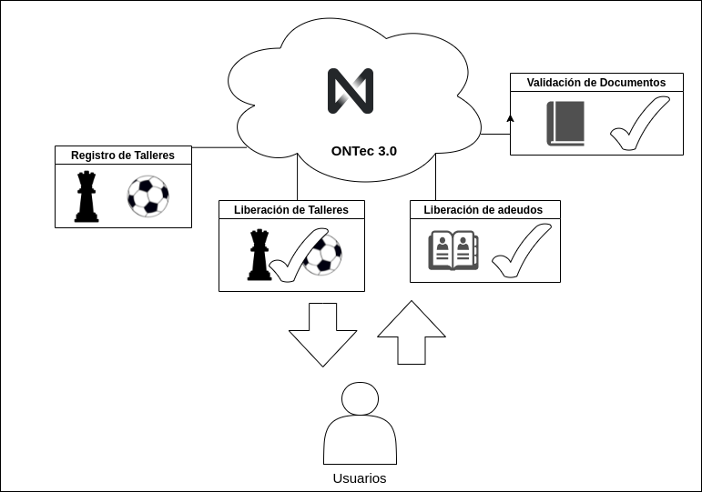
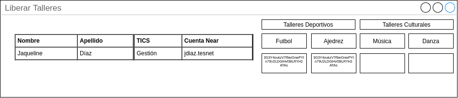

# onTec 3.0 || Versión 1.0

### ¿Qué es onTec 3.0?

Es una plataforma que ayuda a las instituciones a mejorar sus proceso. ONTec 3.0 se está pensando en instituciones educativas que buscan una alternativa a los sistemas convencionales. 

### Ventajas

- La institución tiene un sistema en la que solo paga por las transacciones que realiza sin necesidad de tener un servidor las 24 horas.
- Los alumnos se familiarizan con la web 3.0.
- Posibilidad de generar programas para fondear cuentas.

### ¿Por qué ONTec 3.0 trabaja sobre NEAR?


## Documentación 

### Arquitectura del sistema



### Casos de uso v1.0


### Mockups



### Funciones
Registrar Maestro 
```setAlumno '{"cuenta":"jaque.testnet","numero_control":"56738902837","nombre":"jaqueline","apellidos":"garcia","carrera":"TICS","taller":"voly"}' --accountId jaque.testnet ```

Registrar Taller
``` setMaestro '{"cuenta_maestro":"edflores.testnet","nombre":"Eduardo","apellidos":"Flores","taller":"ajedrez"}' --accountId jaque.testnet  ```

Registrar Instructor
```  setTaller '{"nombre_taller":"ajedrez","horario":"2:00-4:00pm","dias":"Lunes y miercoles","cuenta_maestro":"edflores.testnet"}' --accountId jaque.testnet ```


